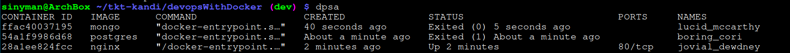
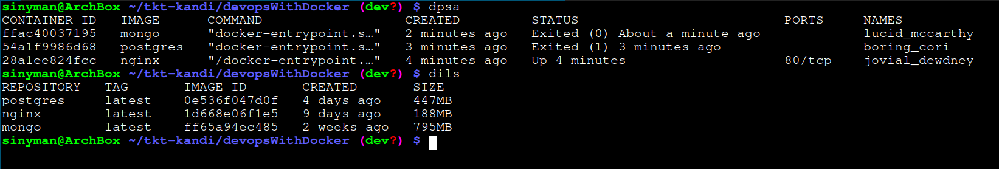
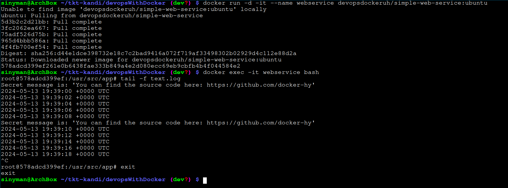
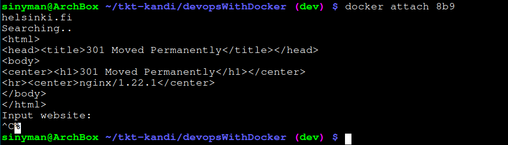

## Submissions for part 1

### Exercise 1.1



### Exercise 1.2

Before


and after


### Exercise 1.3
The commands used and the secret message can be seen in the picture.


### Exercise 1.4
To start the container i used:
```
$ docker run -d -it --name script ubuntu sh -c 'while true; do echo "Input website:"; read website; echo "Searching.."; sleep 1; curl http://$website; done'
```
After that, I attached the container with the following command:
`$ docker attach script`

When prompted for an input, I answered 'helsinki.fi'. This, however, did not work, because curl was not yet installed. I then started a bash-session in the container with `$ docker exec -it script bash`, where I first updated the package manager and all installed packages and then installed curl (`$ apt update && apt upgrade && apt install curl`). After this, when reattaching to the container, I re-entered 'helsinki.fi' and the whole thing worked as intended (here I attached to the container ID instead of name). Screenshot of the result below...


