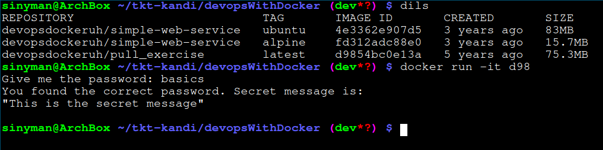

## Submissions for part 1

### Exercise 1.1


### Exercise 1.2

Before


and after


### Exercise 1.3
The commands used and the secret message can be seen in the picture.


### Exercise 1.4
To start the container i used:
```
$ docker run -d -it --name script ubuntu sh -c 'while true; do echo "Input website:"; read website; echo "Searching.."; sleep 1; curl http://$website; done'
```
After that, I attached the container with the following command:
`$ docker attach script`

When prompted for an input, I answered 'helsinki.fi'. This, however, did not work, because curl was not yet installed. I then started a bash-session in the container with `$ docker exec -it script bash`, where I first updated the package manager and all installed packages and then installed curl (`$ apt update && apt upgrade && apt install curl`). After this, when reattaching to the container, I re-entered 'helsinki.fi' and the whole thing worked as intended (here I attached to the container ID instead of name). Screenshot of the result below...


### Exercise 1.5
Downloaded both images with docker pull
```
$ docker pull devopsdockeruh/simple-web-service:ubuntu && docker pull devopsdockeruh/simple-web-service:alpine
```

Looking at the image sizes, we can see that the ubuntu one is quite a lot heavier. This makes sense, as Alpine is made to be a super lightweight distribution.


After that I spun 2 new containers, one running ubuntu and the other one running alpine.
```
$ docker run -d --name alpine devopsdockeruh/simple-web-service:alpine
$ docker run -d --name ubuntu devopsdockeruh/simple-web-service:ubuntu
```

Now I went inside the alpine container to check if the program was running, and surely enough it seems to be working fine:


## Exercise 1.6
Started by pulling the container given in the material, with the command:
`$ docker pull devopsdockeruh/pull_exercise`

When running the container I was prompted for a password that I did not know. Upon opening the DockerHub-page for the image, this came up. Seems that the password the container is looking for could be "basics".


And surely enough, the password was correct!


## Exercise 1.7
The files for this exercise can be found in the [ex_1_7-directory](./ex_1_7).

## Exercise 1.8
The files for this exercise can be found in the [ex_1_8-directory](./ex_1_8).