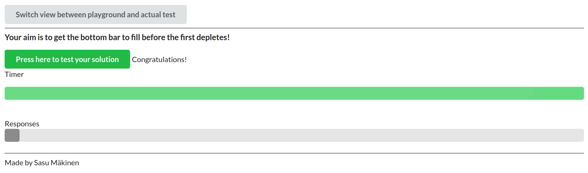
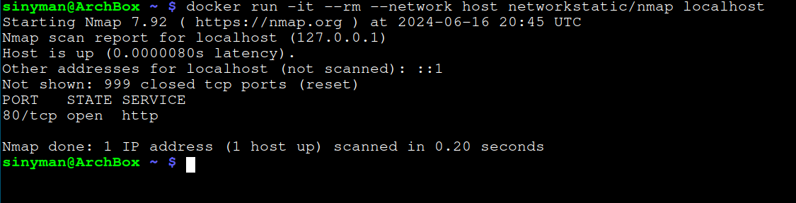

# Submissions for part 2 of DevOps with Docker MOOC 2024

## Exercise 2.1
[The docker-compose.yml file can be found here](./ex_2_1/docker-compose.yml)

## Exercise 2.2
[The docker-compose.yml file can be found here](./ex_2_2/docker-compose.yml)

## Exercise 2.3
[The docker-compose.yml file can be found here](./ex_2_3/docker-compose.yml)

## Exercise 2.4
[The docker-compose.yml file can be found here](./ex_2_4/docker-compose.yml)

## Exercise 2.5
The command I used to run the compose with scaled compute was the following:
```bash
$ docker-compose up --scale compute=10
```
Even though compute seemed exhaustingly slow at first, with scaling 10, it just breezes by with lightning speed. Here is a of my browser after the computing finished:



## Exercise 2.6
[The docker-compose.yml file can be found here](./ex_2_6/docker-compose.yml)

## Exercise 2.7
[The docker-compose.yml file can be found here](./ex_2_7/docker-compose.yml)

## Exercise 2.8
[The docker-compose.yml file can be found here](./ex_2_8/docker-compose.yml)

## Exercise 2.9
[All the necessary files can be found here](./ex_2_9)

I did some changes to the Dockerfiles and built them as v3, which is what was used in docker-compose.yml.
The new Dockerfiles can be found in the `frontend` and `backend` directories.
All of my struggles with this exercise was due to a rouge / missing in nginx.conf :/

## Exercise 2.10
[The docker-compose.yml file can be found here](./ex_2_10/docker-compose.yml)

This is what the portscan returned after removing the ports from docker-compose.yml


## Exercise 2.11

Using my right to skip one exercise per part on this one.
